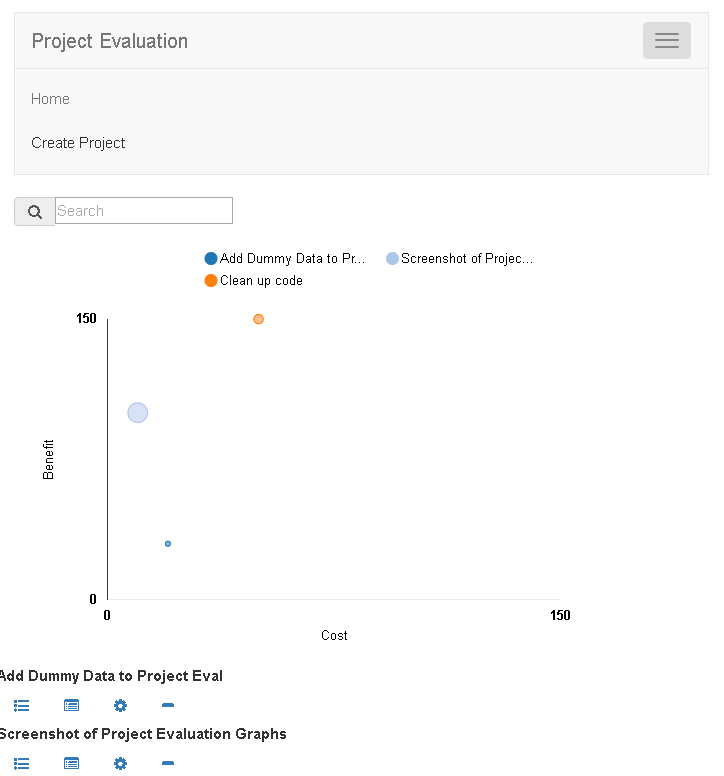

# projectEval
Project Evaluation and ranking with MEAN + D3.js

## Purpose of projectEval 
A useful project to show the cost/benefit ratio of different projects in an interactive graph. 
The page is dynamic and responsive using MEAN, Bootstrap and D3 for graphing

### This project requires
MongoDB installed and running
Node installed

### To install/setup 
Download the zip file
Extract the zip file contents 
in a command prompt browse to the root of the folder 
run 

npm install

npm install -g bower

bower install

